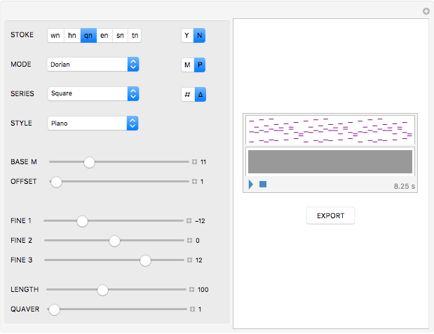

# running-man
generates MIDI files from integer sequences

## requirements
The running-man executable CDF requires a [CDF Player](https://www.wolfram.com/cdf-player/).  The running-man editable Wolfram notebook requires [Mathematica](http://www.wolfram.com/mathematica/).
<p align="center">

</p>

### 1. pitch class integer notation
running-man uses [integer notation](https://en.wikipedia.org/wiki/Pitch_class#Integer_notation) which represents notes as pitch classes (PCs).  For example, if C♮ = 0, then C♯ = 1, D♮ = 2, D♯ = 3, and so on.  PCs including more than one member represent harmonies and/or scales.  For example, C♮ Major Triad {0, 4, 7}, D♮ Minor Triad {2, 5, 9}, F♮ Major Seventh Chord {5, 9, 0, 4};  etc.  In PC integer notation each pitch is included in the same class regardless its octave position (e.g., C4 = 0, C5 = 0; D3 = 2, D6 = 2; etc.).  

| **Letter Notation** | **Pitch Class** |
| :---: | :---: |
| C♮  | 0  |
|  C♯ | 1  | 
| D♮  | 2  | 
|  D♯ | 3  | 
| E♮  | 4  | 
| F♮  | 5  |    
|  F♯ | 6  |   
| G♮  | 7  |
|  G♯ | 8  |
| A♮  | 9  |
|  A♯ | 10 |
| B♮  | 11 |
| E♮ Minor Triad | {4, 5, 9} |
| C♮ Major Scale | {0, 2, 4, 5, 7, , 9, 11} |

### 2. basic functions
#### 2.1 wolfram language functions
running-man makes frequent use of these basic Wolfram Language functions.  For more detailed explanations of these functions, visit the [Reference Site](http://reference.wolfram.com/language/).

- **Range[**_n_**]** gives the set {1, 2, ..., _n_}.
- **Table[**_f_, _n_**]** gives the set of _n_ values of _f_.
- **With[**{_a_=_x_, _b_=_y_, ...}, _expr_**]** replaces all _a_, _b_, ... in _expr_ with _x_, _y_, ... 
- **Take[**_set_, _n_**]** gives the first _n_ elements belonging to _set_.
- **Mod[**_m_, _n_, _o_**]** gives the remainder after division of dividend _m_ by divisor _n_ (i.e., _m_ mod _n_), defining the optional offset _o_ argument gives the _x_ such that _o_ ≤ _x_ ≥ _o_ + _n_ and _x_ mod _n_ = _m_ mod _n_.
- **Map[**_f_, _set_ **]** or _f_**/@**_set_ applies _f_ to each element belonging to _set_. 
- **Flatten[**_set_**]** gives the set of subsets and atomic elements (elements that do not belong to a subset) belonging to _set_.
- **Differences[**_set_**]** gives the successive differences between each element belonging to _set_.
- **LinearRecurrence[**_ker_, _int_ ,_n_**]** gives the set of _n_ values of the linear recurrence relation with kernel _ker_ and initial values _int_.

#### 2.2 integer sequence functions
The Wolfram Language contains an extensive collection of integer sequence functions.  For example, the 4th number of the Fibonacci sequence (i.e., 1, 1, 2, 3, 4, ...) can be given by entering:  

```mathematica
In[]:= Fibonoacci[4]
Out[]:= 3
```
and iterative functions (e.g, **Table[]**, **Range[]**) will generate a set of each sucessive element in the sequence: 

```mathematica
In[]:= Fibonacci[Range[12]]
Out[]:= {1, 1, 2, 3, 5, 8, 13, 21, 34, 55, 89, 144}
```
```mathematica
In[]:= Table[Fibonacci[x], {x, 1, 12}]
Out[]:= {1, 1, 2, 3, 5, 8, 13, 21, 34, 55, 89, 144}
```
[The Online Encyclopedia of Interger Sequences](https://oeis.org/) also contains formulae for generating integer sequences in the Wolfram Language.  For example, the OEIS entry for the square numbers [OEIS A000290](https://oeis.org/A000290) contains the following code for generating the square numbers using the **LinearRecurrence[]** function: 

```mathematica
In[]:= LinearRecurrence[{3, -3, 1}, {0, 1, 4}, 12]
Out[]:= 0,1,4,9,16,25,36,49,64,81,100,121,144
```
#### 2.3 window function
running-man uses a moving window function to position and/or aggregate succesive integers along a time axis:

```mathematica
MovingWindow[f_, exp_, n_, o_] := 
  Module[{len = Length[exp], end}, end = Min[n, len] - 1;
   Table[Apply[f, {exp[[i ;; i + end]]}], {i, 1, len - end, o}]];
```
###### c.f., _Mathematica Cookbook_, Sal Mangano: 44

The **MovingWindow[**_f_, _set_, _n_, _o_**]** function positions and/or aggregates elements generated by _f_ by groups of _n_ at an offset of _o_.  For example, using the **MovingWindow[]** with function **Take[**_set_,_n_**]**, and a group and offset of 3 gives:

```mathematica
In[]:= MovingWindow[Take, Fibonacci[Range[9]], 3, 3]
Out[]:={{1, 1, 2}, {3, 5, 8}, {13, 21, 34}}
```
a group of 3 and an offset of 1 gives:

```mathematica
In[]:= MovingWindow[Take, Fibonacci[Range[9]], 3, 1]
Out[]:= {{1, 1, 2}, {1, 2, 3}, {2, 3, 5}, {3, 5, 8}}
```

a group of 1 and an offset of 3 gives:
```mathematica
In[]:=MovingWindow[Take, Fibonacci[Range[9]], 1, 3]
Out[]:={{1}, {3}, {13}}
```

### 3. MIDI pitch event translations
#### 3.1 mono function
running-man uses the **Mono[]** function to translate the integer sequences into MIDI pitch events in the scale _m_:

```mathematica
Mono[m_] := 
  With[{arb = exp}, Take[arb, {#}] & /@ Mod[d@F[ln], mB, mI]];
```
###### c.f., _Programming Avro Part_, [link](https://aestheticcomplexity.wordpress.com/2011/11/11/programming-arvo-part/)

##### 3.1.1 variables of the mono function 
In the exceutable CDF, variables of the **Mono[]** function are assigned by way of GUI.  When running-man is initialized, the variables of the **Mono[]** function (e.g., _d_, _F_, _len_, ...) are automatically assigned the following values:  

|             **variable**                    | **assignment** |
| :---: | :--- |
|**_mB_** = 7| The Modular Divisor|
|**_mI_** = 1| The Modular Offset |
|**_d_** = Flatten| If d = **Flatten[]**, pitches are generated from successive cardinalities. <br /> If d = **Differences[]**, pitches are generated from successive differences.|
|**_F_** = Fibonacci[]| The integer sequence function (e.g., Prime, Square, Odd, etc) used to generate pitches.| 
| **_len_** = 100 | The length of the pitch set to be generated |
|**m** = {0, 2, 3, 5, 7, 9, 10, 0, 2, 3, 5, 7, 9, 10} | The integer notation for the Dorian mode | 

```mathematica
In[]:= Mono[dorian]
Out[]:= {0, 0, 2, 3, 7, 0, 9, 10, 9, 9, 7, 5}
```
change a variable to generate pitches from differences rather than from cardinalities:

```mathematica
In[]:= d = Differences;
Out[]:= {10, 0, 0, 2, 3, 7, 0, 9, 10, 9, 9}
```
change a variable to generate pitches from ionian scale rather than from the dorian scale:

```mathematica
In[]:= Mono[ionian]
Out[]:= {11, 0, 0, 2, 4, 7, 0, 9, 11, 9, 9}
```
The table above illusrates how **Mono[**_dorian_**]** with _F_ defined as the Fibonacci sequence (1, 1, 2, 3, 5, ...) translates the sequence into pitch events in the dorian scale.

|           **function**                   | 1     | 2     | 3     | 4     | 5     | 6     | 7     | 8     | 9     | 10    | 11    | 12    |
| :---:                              | :---: | :---: | :---: | :---: | :---: | :---: | :---: | :---: | :---: | :---: | :---: | :---: | 
|dorian PCs                             | 0     | 2     | 3     | 5     | 7     | 9     | 10    | 0     | 2     | 3     | 5     | 7     |
|F<sub>*n*+1</sub> mod 7             | 1     | 1     | 2     | 3     | 5     | 1     | 6     | 7     | 6     | 6     | 5     | 4     |
|F<sub>*n*+1</sub> mod 7 /@ dor PCs  | 0     | 0     | 2 | 3 | 7 | 0 | 9 | 10 | 9 | 9 | 7 | 5 |
|Δ F<sub>*n*+1</sub> mod 7 /@ dor PCs|N/A    |10     | 0 | 0 | 2 | 3 | 7 | 0 | 9 | 10 | 9 | 9|

#### 3.1 harmonize function
The **Harmonize[]** function gives a nested subset (i.e., aggregate, a _chord_) of any three consecutive PCs constituting a major or a minor triad.

```mathematica
Harmonize[exp_] := 
 With[{n1 = Take[exp, {1}], n2 = Take[exp, {2}], 
   n3 = Take[exp, {3}]},
  If[n2 == (n1 + 0) && n3 == (n1 + 0) || 
    n2 == (n1 + 0) && n3 == (n1 + 3) || 
    n2 == (n1 + 0) && n3 == (n1 + 7) || 
    etc. etc.
```
#### 3.2 poly function
The **Poly[]** function runs a **MovingWindow[]** of **Harmonize[]** over the sets given by **Mono[]**.  

```mathematica
Poly[exp_] := MovingWindow[Harmonize, Mono[m], 3, 3];
```
## future work
⋅⋅* pitch duration / rhythmic generation.
..* harmonies of more than three voices
..* passing tones, suspensions, escape tones, etc.
..* option to select GM instruments besides default piano.
